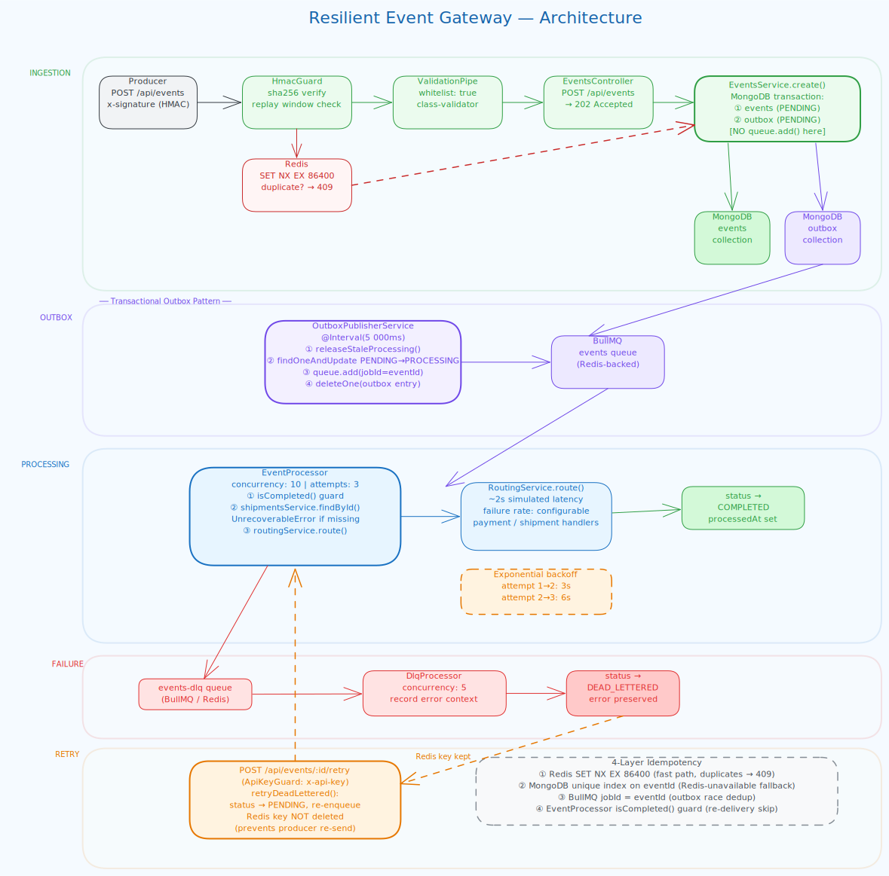
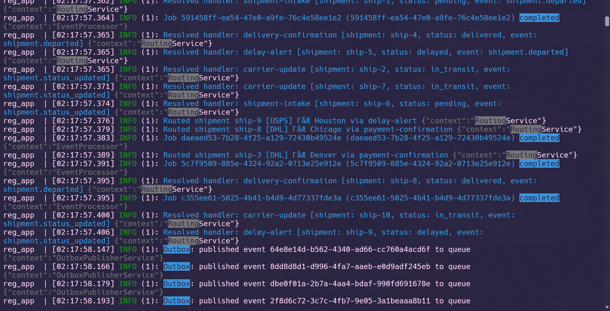
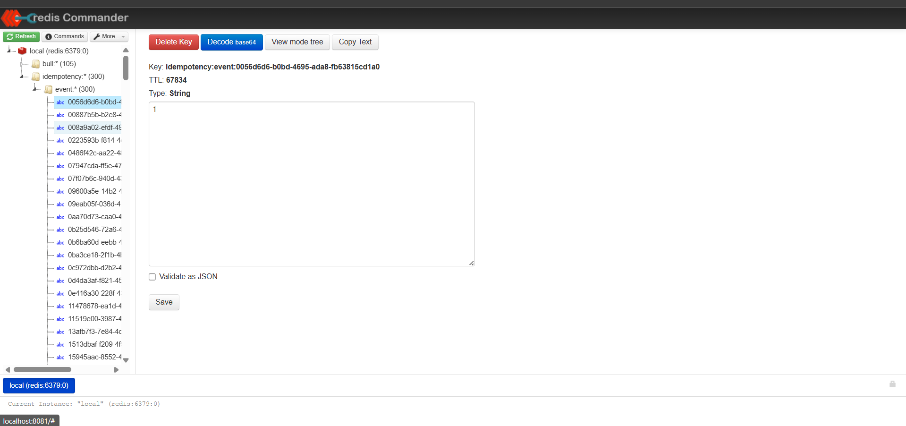
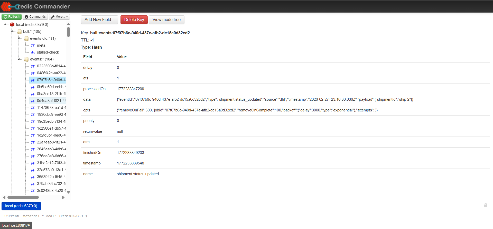
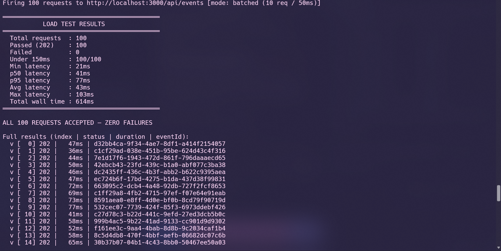
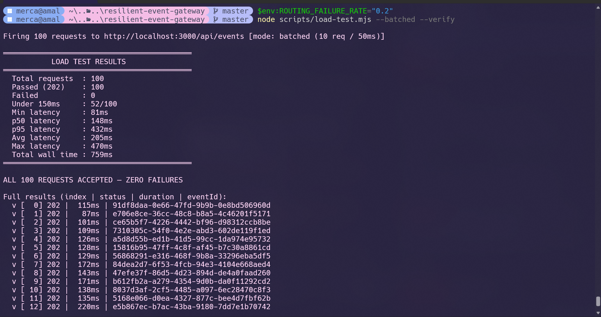
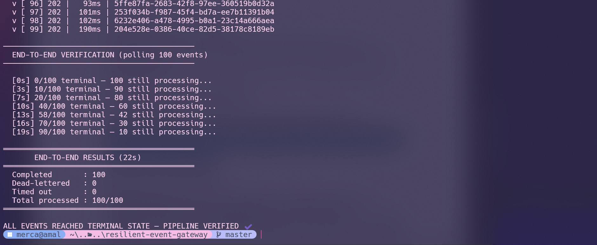

# Resilient Event Gateway

A NestJS webhook ingestion service built around the **transactional outbox pattern**. Events are accepted over HTTP, persisted atomically to MongoDB, then delivered to a BullMQ worker through a polling publisher — so the queue is never a point of failure at ingestion time.

**Stack:** NestJS 11 · TypeScript 5.7 · MongoDB 7 (replica set) · Redis 7 · BullMQ 5 · Docker

---

## Architecture



### Five processing lanes

| Lane           | Colour | What happens                                                                    |
| -------------- | ------ | ------------------------------------------------------------------------------- |
| **INGESTION**  | green  | HMAC verify → Redis idempotency check → MongoDB transaction                     |
| **OUTBOX**     | purple | Outbox publisher polls every 5 s, atomically claims entries, enqueues to BullMQ |
| **PROCESSING** | blue   | EventProcessor (concurrency 10) routes the event, marks COMPLETED               |
| **FAILURE**    | red    | All retries exhausted → events-dlq → DlqProcessor → DEAD_LETTERED               |
| **RETRY**      | orange | Operator calls POST /retry → back to PENDING (Redis key preserved)              |

### Thin ingestion layer — < 150ms handshake

The ingestion path does exactly three things and nothing else:

```
POST /api/events
  1. HmacGuard          — verify x-signature, check replay window
  2. Redis SET NX       — reject duplicates in < 1ms
  3. MongoDB transaction — write events + outbox atomically
  → 202 Accepted
```

No routing logic. No downstream calls. No shipment lookup. All of that runs in the background worker after the response is already sent. The batched load test confirms this: **p50 41ms, p95 77ms, 100/100 requests under 150ms**.

### 2-second routing delay — pipeline not stalled

`RoutingService.route()` simulates a 2-second downstream call. This runs inside `EventProcessor` — a BullMQ worker completely separate from the HTTP server. The ingestion layer has already returned `202` and is free to accept the next request. With `concurrency: 10`, up to 10 events process their 2-second routing calls in parallel without any of them blocking ingestion or each other.

The logs below show the separation clearly — `RoutingService` resolving handlers, jobs marked `completed`, and `OutboxPublisherService` publishing events to the queue, all happening seconds after ingestion already returned:



```
Producer  →  HmacGuard  →  Redis SET NX  →  EventsController
                                                    │
                                          MongoDB transaction
                                          ├── events    (PENDING)
                                          └── outbox    (PENDING)
                                                    │
                                             202 Accepted        ← response sent here
                                    [worker starts independently]

OutboxPublisherService  @Interval(5 s)
  ① releaseStaleProcessing()            — reclaim crashed entries
  ② findOneAndUpdate PENDING→PROCESSING — atomic claim (no double-publish)
  ③ queue.add(jobId = eventId)          — BullMQ dedup by job ID
  ④ deleteOne(outbox entry)

EventProcessor  (concurrency 10 · attempts 3 · exponential backoff)
  ① isCompleted() guard                — skip re-delivered completed jobs
  ② shipmentsService.findById()        — UnrecoverableError if missing → DLQ
  ③ routingService.route()             — 2 s simulated downstream call
  └── status → COMPLETED

onFailed → events-dlq → DlqProcessor → status → DEAD_LETTERED

POST /api/events/:id/retry  (ApiKeyGuard)
  └── retryDeadLettered(): DEAD_LETTERED → PENDING, re-enqueue
      [Redis key intentionally NOT deleted]
```

---

## Dead Letter Queue Strategy

BullMQ's built-in `failed` state lives only in Redis. If Redis is flushed or the job TTL expires, the failure record disappears with no audit trail. This system uses a dedicated `events-dlq` queue and `DlqProcessor` that writes every terminal failure into MongoDB — the database becomes the authoritative record of what failed and why, independently of the queue's lifetime.

### Two failure classes

Not all failures are equal. Treating them the same wastes retries on problems that will never resolve on their own.

| Class             | How to signal                       | Behaviour                                                         |
| ----------------- | ----------------------------------- | ----------------------------------------------------------------- |
| **Recoverable**   | `throw new Error(...)`              | Retried up to `QUEUE_JOB_ATTEMPTS` times with exponential backoff |
| **Unrecoverable** | `throw new UnrecoverableError(...)` | Skips all remaining retries, goes straight to DLQ immediately     |

A routing service timeout is transient — back off and retry. A missing shipment ID is a data problem — retrying it three times wastes 9 seconds and still fails. `UnrecoverableError` routes it to the DLQ immediately so the operator sees it without delay.

### Retry schedule

```
Attempt 1 fails  →  wait 3 s   (QUEUE_BACKOFF_DELAY_MS)
Attempt 2 fails  →  wait 6 s   (QUEUE_BACKOFF_DELAY_MS × 2)
Attempt 3 fails  →  events-dlq
```

Both values are environment variables — tunable per deployment without a code change.

### DLQ behaviour

`DlqProcessor` sets `status: DEAD_LETTERED` and writes the full `error.message` and `error.stack` onto the MongoDB event document. The event is queryable with its complete failure context preserved.

The Redis idempotency key for that `eventId` is intentionally **not deleted**. Without it, the original producer could re-send the same payload and it would be accepted as a new event, silently skipping the failure. Keeping the key means recovery must go through the explicit `/retry` endpoint — an operator action, not an automatic bypass.

### Recovery

```http
POST /api/events/:eventId/retry
x-api-key: <API_KEY>
```

1. `GET /api/events/:eventId` — read the preserved error and stack trace.
2. Fix the root cause (e.g. backfill the missing shipment).
3. Call `/retry` — status resets to `PENDING`, job re-enqueues into the `events` queue.
4. `EventProcessor` processes it from the beginning.

---

## Eventual Consistency

The system returns `202 Accepted` immediately and processes asynchronously. Consistency is maintained through the outbox pattern and layered idempotency — together they guarantee every accepted event reaches a terminal state regardless of where a failure occurs.

### Atomic ingestion

`EventsService.create()` writes to both the `events` collection and the `outbox` collection in a single MongoDB replica-set transaction. Both succeed or neither does. There is no state where an event exists without a corresponding outbox entry.

### Outbox as a durable delivery guarantee

Once the outbox entry is committed, the event will be queued — even if the process crashes immediately after returning `202`, or Redis is temporarily unavailable at ingestion time.

`OutboxPublisherService` polls every 5 seconds, atomically claims one outbox entry with `findOneAndUpdate`, calls `queue.add(jobId = eventId)`, then deletes the entry. If the process crashes between the `queue.add()` and `deleteOne`, the entry stays in `PROCESSING`. At the start of every poll cycle, `releaseStaleProcessing()` resets any entry older than `OUTBOX_STALE_THRESHOLD_MS` back to `PENDING` — the job re-enqueues, and BullMQ's `jobId` deduplication makes the second enqueue a no-op if the first already landed.

### Idempotency across all failure points

Duplicate events are normal in logistics pipelines. Each layer below operates independently — if one is bypassed or unavailable, the next one catches it.

| Layer | Mechanism                         | Failure covered                                           |
| ----- | --------------------------------- | --------------------------------------------------------- |
| 1     | Redis `SET NX EX 86400`           | Duplicate POST from producer — rejected in < 1ms          |
| 2     | MongoDB unique index on `eventId` | Duplicate POST when Redis is unavailable                  |
| 3     | BullMQ `jobId = eventId`          | Outbox publisher enqueues the same entry twice            |
| 4     | Worker `isCompleted()` guard      | BullMQ re-delivers a job that already completed           |

### Consistency window

| Transition                          | Maximum lag                                            |
| ----------------------------------- | ------------------------------------------------------ |
| `202 Accepted` → job enqueued       | ≤ 5 s (`OUTBOX_INTERVAL_MS`)                           |
| Job enqueued → `COMPLETED`          | ≤ 9 s (3 attempts at default exponential backoff)      |
| All attempts fail → `DEAD_LETTERED` | Immediately after the final attempt                    |

The load test `--verify` flag confirms this in practice: after 100 concurrent ingestions, all 100 events reached `COMPLETED` in MongoDB within 22 seconds — zero losses, zero timeouts.

---

## Running the stack

**Requirements:** Docker + Docker Compose only.

```bash
# 1. Copy env
cp .env.example .env

# 2. Start everything (app + MongoDB replica set + Redis + Redis GUI)
docker compose up --build
```

Wait ~30 s for the replica set to initialise, then check health:

```bash
curl http://localhost:3000/api/health
# {"status":"ok","info":{"mongodb":{"status":"up"},"redis":{"status":"up"}},...}
```

### Available services

| Service         | URL                              | Notes                                         |
| --------------- | -------------------------------- | --------------------------------------------- |
| Gateway API     | http://localhost:3000            | Main application                              |
| Health check    | http://localhost:3000/api/health | No auth required                              |
| Redis Commander | http://localhost:8081            | GUI — inspect BullMQ queues, idempotency keys |

### Redis Commander — live view after load test

Open **http://localhost:8081** after `docker compose up`.

**Key namespaces to inspect:**

| Namespace | Count after 100-event load test | What it shows |
|---|---|---|
| `bull:*` | 105 | All BullMQ job keys — events queue + DLQ metadata |
| `bull:events:*` | 104 | Completed job hashes with full data, opts, backoff config |
| `bull:events-dlq:*` | 1 | Any job that exhausted all retries |
| `idempotency:*` | 300 | Redis `SET NX` keys — one per accepted event, TTL 86400s |

**Overview — 105 BullMQ keys + 300 idempotency keys:**


**Idempotency key detail — `SET NX` value is `1`, TTL counts down from 86400s:**



**BullMQ job detail — full event payload, backoff config (`delay:3000, type:exponential`), attempt count:**



---

## Load test

```powershell
$env:WEBHOOK_SECRET="change-me-to-a-strong-random-secret"
$env:API_KEY="internal-api-key-change-me"
```

### Batched — realistic ingestion latency

10 requests every 50ms. Connections are warm, no burst at the OS TCP stack. This is the accurate per-request latency measurement.

```powershell
node scripts/load-test.mjs --batched
```



```
Total requests  : 100     Passed (202)    : 100
Failed          : 0       Under 150ms     : 100/100
Min latency     : 12ms    p50 latency     : 41ms
p95 latency     : 77ms    Total wall time : 614ms

ALL 100 REQUESTS ACCEPTED — ZERO FAILURES
```

### Batched + pipeline verification

Same batched mode with `--verify` and `ROUTING_FAILURE_RATE=0.2`. After all 100 ingestions return `202`, the script polls `GET /api/events/:id` against MongoDB until every event reaches a terminal state. This proves the full async pipeline ran — ingestion, outbox, worker, routing — not just that the HTTP layer accepted.

```powershell
$env:ROUTING_FAILURE_RATE="0.2"
node scripts/load-test.mjs --batched --verify
```





All 100 events reached `COMPLETED` within 22 seconds — including events that failed and retried — zero losses.

---

## Unit tests

All infrastructure (MongoDB, Redis, BullMQ) is mocked. No Docker required.

```bash
npm install && npm test
```

```
 PASS  src/infrastructure/guards/hmac.guard.spec.ts
 PASS  src/events/processors/dlq.processor.spec.ts
 PASS  src/events/processors/event.processor.spec.ts
 PASS  src/events/events.service.spec.ts
 PASS  src/events/outbox-publisher.service.spec.ts

Test Suites: 5 passed, 5 total
Tests:       54 passed, 54 total
Time:        1.877 s
```

Any WARN or ERROR output during the run is intentional — the suites deliberately exercise failure paths and assert on them.

### What each suite covers

**`events.service.spec.ts`**
- `create()` writes both `events` and `outbox` inside a single `withTransaction` call — neither write can succeed without the other
- `create()` never calls `queue.add()` directly — BullMQ is not touched at ingestion time
- Redis `SET NX` returning `null` → `ConflictException`, transaction is never opened
- Redis throwing → graceful degradation, transaction still runs (MongoDB unique index is the fallback)
- Session is always closed, even when the transaction throws
- `retryDeadLettered()` uses a `retry-` prefixed jobId to bypass BullMQ dedup, and does **not** delete the Redis idempotency key

**`event.processor.spec.ts`**
- Happy path: `PROCESSING` then `COMPLETED`, routing service called with correct shipment and event type
- `isCompleted()` returns true → job acknowledged without any status write or routing call
- Shipment not found → `UnrecoverableError` thrown, no status written (DLQ handles the terminal state)
- Routing service throws → `PROCESSING` written before the error, error re-thrown for BullMQ retry
- `onFailed()` with remaining attempts → status reset to `PENDING`, DLQ not touched
- `onFailed()` with exhausted attempts → job forwarded to `events-dlq`, no status written
- `onFailed()` with `UnrecoverableError` on first attempt → immediately forwarded to DLQ

**`dlq.processor.spec.ts`**
- Sets `status: DEAD_LETTERED` and writes `error.message` + `error.stack` to the event document

**`outbox-publisher.service.spec.ts`**
- Atomic `findOneAndUpdate` claim prevents double-publish
- `releaseStaleProcessing()` resets stuck `PROCESSING` entries on every cycle
- BullMQ publish failure does not crash the publisher — the outbox entry stays for the next cycle

**`hmac.guard.spec.ts`**
- Missing `x-signature` header → 401
- Raw body not available → 401
- Signature mismatch → 401
- Request timestamp outside replay window → 401
- Valid HMAC → request passes through

---

## API reference

All routes prefixed with `/api`.

| Method | Path                         | Auth                        | Description                      |
| ------ | ---------------------------- | --------------------------- | -------------------------------- |
| `POST` | `/api/events`                | `x-signature` (HMAC-SHA256) | Ingest an event → 202            |
| `GET`  | `/api/events`                | `x-api-key`                 | List events (cursor pagination)  |
| `GET`  | `/api/events/:eventId`       | `x-api-key`                 | Get single event + status        |
| `POST` | `/api/events/:eventId/retry` | `x-api-key`                 | Re-enqueue a dead-lettered event |
| `GET`  | `/api/health`                | none                        | MongoDB + Redis liveness         |

### POST /api/events body

```json
{
  "eventId": "550e8400-e29b-41d4-a716-446655440000",
  "type": "shipment.status_updated",
  "source": "fedex",
  "timestamp": "2026-01-01T00:00:00.000Z",
  "payload": { "shipmentId": "ship-1" }
}
```

`x-signature` header must be `sha256=<HMAC-SHA256 of raw request body>` using `WEBHOOK_SECRET`.

### Event status lifecycle

```
PENDING → PROCESSING → COMPLETED
                  ↓ (transient fail, BullMQ retries)
               PENDING
                  ↓ (all attempts exhausted)
          DEAD_LETTERED
                  ↓ (POST /retry)
               PENDING
```

---

## Project structure

```
src/
├── config/                      Centralised config with fail-fast validation
├── infrastructure/
│   ├── filters/                 AllExceptionsFilter — normalised error shape
│   ├── guards/                  HmacGuard (ingestion) · ApiKeyGuard (read/retry)
│   └── redis/                   Global ioredis provider + graceful shutdown hook
├── events/
│   ├── dto/                     CreateEventDto · PaginationQueryDto
│   ├── schemas/                 Event schema · OutboxEntry schema
│   ├── processors/              EventProcessor · DlqProcessor
│   ├── events.controller.ts     POST /events · GET /events · GET /events/:id · POST /retry
│   ├── events.service.ts        create() · idempotency · retryDeadLettered()
│   ├── event-routing.service.ts Simulated downstream routing (swap for real HTTP calls)
│   └── outbox-publisher.service.ts  @Interval poller — outbox → BullMQ
├── shipments/
│   ├── schemas/                 Shipment schema
│   ├── shipments.service.ts     findByShipmentId()
│   └── shipment-seed.service.ts Seeds 10 shipments on startup
└── health/                      GET /api/health (mongoose + redis indicators)
```

---

## Environment variables

| Variable                    | Default         | Description                                                |
| --------------------------- | --------------- | ---------------------------------------------------------- |
| `WEBHOOK_SECRET`            | —               | HMAC signing secret (required)                             |
| `API_KEY`                   | —               | Key for read/retry endpoints (required)                    |
| `MONGO_URI`                 | —               | MongoDB connection string with `replicaSet=rs0` (required) |
| `REDIS_HOST`                | `localhost`     | Redis host                                                 |
| `REDIS_PASSWORD`            | `redispassword` | Redis password                                             |
| `ROUTING_FAILURE_RATE`      | `0`             | Simulated downstream failure rate 0–1                      |
| `QUEUE_JOB_ATTEMPTS`        | `3`             | Max retry attempts per job                                 |
| `QUEUE_BACKOFF_DELAY_MS`    | `3000`          | Base backoff (ms), doubles each retry                      |
| `OUTBOX_INTERVAL_MS`        | `5000`          | Outbox publisher poll interval (ms)                        |
| `OUTBOX_STALE_THRESHOLD_MS` | `60000`         | Age before a PROCESSING outbox entry is reclaimed          |
| `WEBHOOK_REPLAY_WINDOW_MS`  | `300000`        | Max age of a valid HMAC request timestamp (ms)             |

See [.env.example](.env.example) for a complete template.

---

## AI Disclosure

Generative AI (Claude) was used during the development of this project. All architectural decisions, prompts used, and the reasoning behind each design choice are documented in [PROMPTS.md](PROMPTS.md) as required by the assessment.
